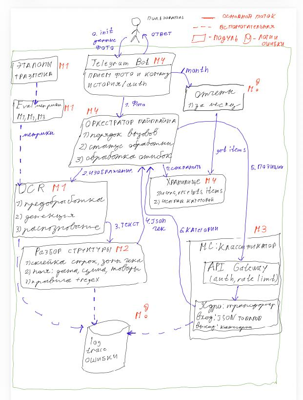

# receipt-tracker

Трекер расходов по фотографиям чеков.

Сфотографировал чек, отправил Telegram-боту и через пару секунд получил ответ: где была покупка, на какую сумму и как траты делятся по категориям — продукты, бытовая химия и так далее. Если бот ошибся с категорией, её можно поправить одной кнопкой. А в конце месяца бот покажет, куда ушли деньги, какие категории самые затратные и как это соотносится с прошлым месяцем.

Никаких таблиц и ручного ввода — только фото чека.

Проект учебный, разрабатывается командой из четырёх человек осенью 2026 года.

## Модули

- **M1 (OCR)**: принимает фото чека и возвращает распознанный текст с координатами.
- **M2 (разбор структуры)**: превращает текст в JSON-чек (дата, сумма, товары). Поля извлекаются правилами, без LLM.
- **M3 (классификатор)**: распределяет товары по категориям с помощью трансформера и строит отчёты за месяц.
- **M4 (бот, оркестратор, хранилище)**: общается с пользователем, вызывает M1, M2 и M3 по очереди и сохраняет данные.

## Архитектура



Подробное описание: [docs/architecture.pdf](docs/architecture.pdf).

## Запуск бота

```bash
uv sync
cp .env.example .env  # вписать токен бота в BOT_TOKEN
uv run python -m bot
```

## Команда

- Андрей Карабанов
- Даниил Качанов
- Артем Зайцев
- Даниил Горляков

## Как участвовать

Правила разработки, оформления кода и коммитов описаны в [CONTRIBUTING.md](CONTRIBUTING.md).
